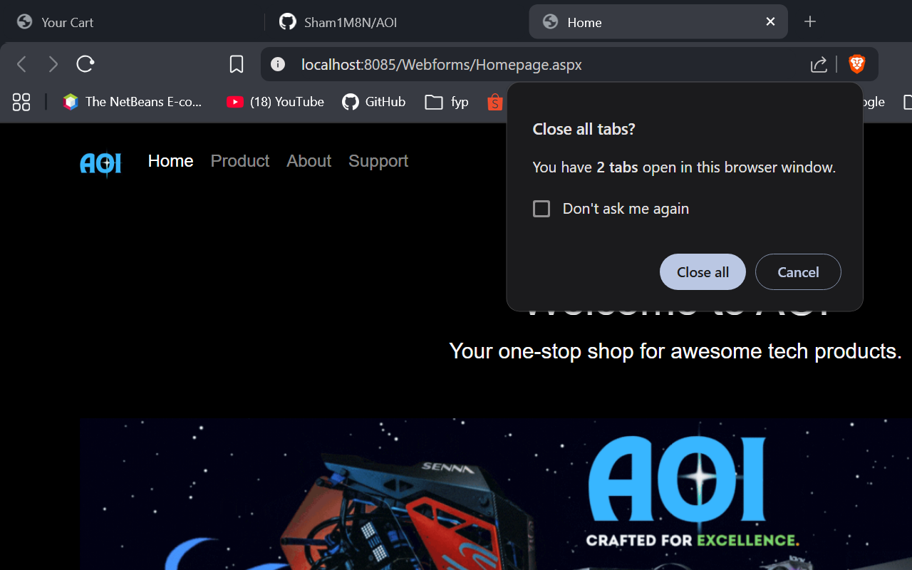
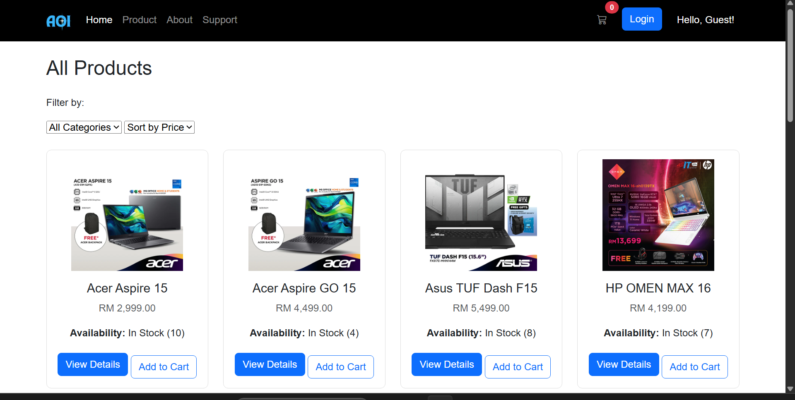
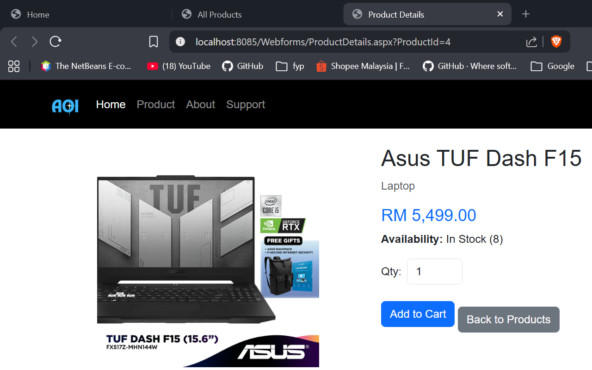
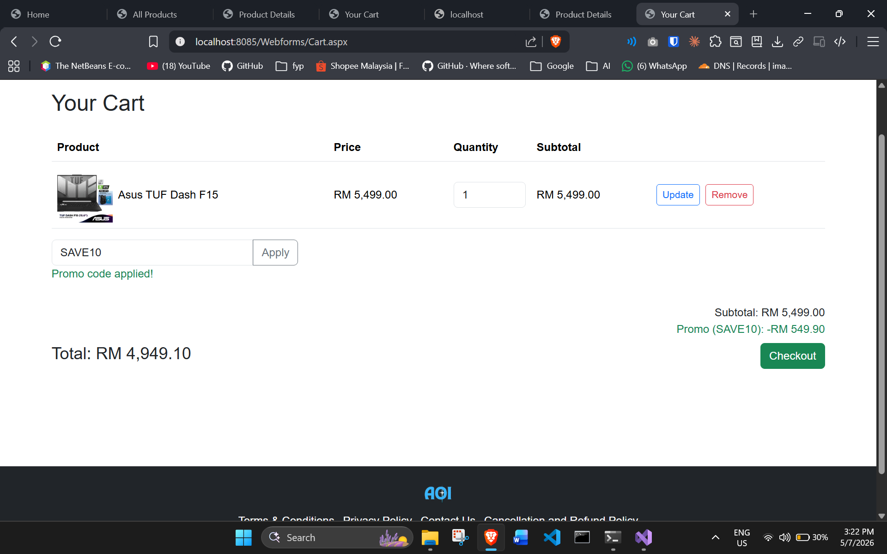
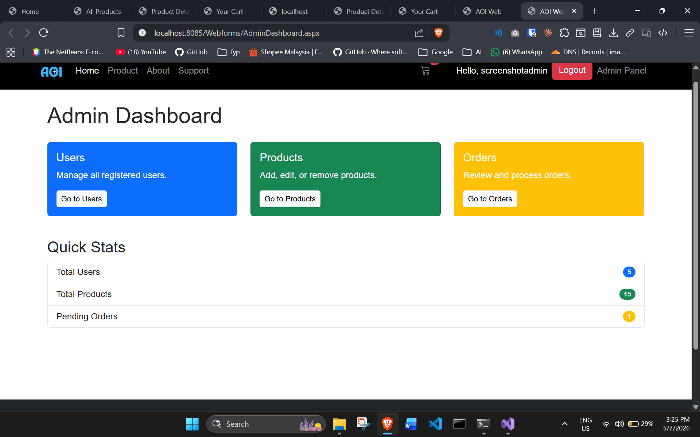

# AOI

An e-commerce site for computer parts and laptops. Browsing, cart, checkout, promo codes, all of it, plus an admin side for managing products, orders, and users. Built with ASP.NET Web Forms and SQL Server.

## Screenshots

**Homepage**


**Product Listing** (filter by category, sort by price)


**Product Details** (shows real-time stock before you can add to cart)


**Cart** (promo code applied, discount and total worked out live)


**Admin Dashboard** (the numbers here come straight from the database, not hardcoded)


## What it does

**As a customer, you can:**
- Browse by category (Laptop / Desktop / Accessories) and sort by price
- Add things to your cart. It won't let you add more than what's actually in stock, and checks again at checkout in case stock changed in the meantime
- Apply promo codes for a percentage off
- Register and log in with your password actually stored safely

**As an admin, you can:**
- See live stats on the dashboard: total users, products, pending orders
- Add, edit, and delete products (deleting one that's already part of an order is blocked with a clear message instead of crashing)
- Manage users: edit details, reset passwords, delete accounts
- Manage orders: check what's in them, update their status

## Built with

- ASP.NET Web Forms, C#, .NET Framework 4.7.2
- SQL Server LocalDB
- Bootstrap 5

## Running it yourself

1. Clone the repo
2. Set up the database. This creates the LocalDB file and fills it with sample products plus a default admin account:
   ```powershell
   Database/setup-database.ps1
   ```
3. Open `AOI.sln` in Visual Studio and hit F5

You can log in as `admin` / `Admin123!` to poke around the admin side. **Change that password** before you use this for anything beyond your own machine, since the hash for it is sitting right there in the script, in a public repo.

## A note on security

I made a point of getting a few things right here rather than skipping them. Passwords are hashed with salted PBKDF2 (100,000 iterations, not a bare SHA-256), every SQL query is parameterized, and anything user-supplied gets HTML-encoded before it's rendered so it can't be used for stored XSS. Stock is checked both when something's added to the cart and again at checkout, so two people can't both "buy" the last unit.

## License

MIT, see [LICENSE](LICENSE).
